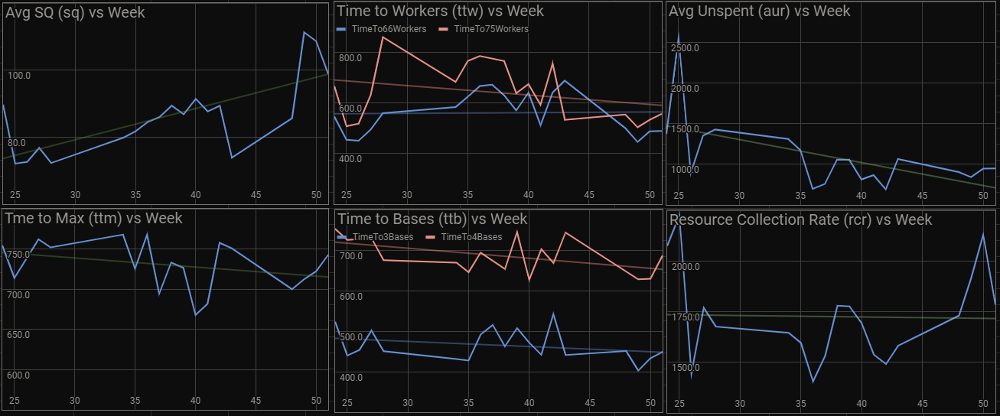

.. Starcraft2Metrics documentation master file, created by
   sphinx-quickstart on Mon Mar 25 17:34:05 2019.
   You can adapt this file completely to your liking, but it should at least
   contain the root `toctree` directive.

Starcraft 2 Metrics User Manual
===============================

Starcraft2Metrics offers metrics calculated from replay files using the :ref:`sc2reader_section` parser.

The end goal of Starcraft2Metrics is to offer the user a visualization of the trend of 
each metric that is calculated in order for the user to see if there has been improvement 
over a period of time. This information can be used to locate weak points in a player's
skill and improve that area.

	
	Example Trends derived from Metric data.

	
SC2ReplayParser
===============
The SC2ReplayParser is a command line utility that will gather metric data from a directory
of replays. The parser will output a csv file that contains a number of useful metrics along
with metadata about each replay. The metric data can then be used to derive trends.

Replay metadata:

* Replay Name
* Date
* Map
* Race Matchup
* Game Length
* Game Type
* Is Ladder?

Metrics offered:

* Time to Max (ttm)
* Time to 3 bases (ttb3)
* Time to 4 bases (ttb4)
* Time to 66 workers (ttw66)
* Time to 75 workers (ttw75)
* Average APM (apm)
* Average Spending Quotient (sq)
* Average Spending Quotient Pre-Max Supply (sq-max)
* Average Unspent Resources (aur)
* Average Unspent Resources Pre-Max Supply (aur-max)
* Average Resource Collection Rate (rcr)
* Average Resource Collection Rate Pre-Max Supply (rcr-max)
* Time spent Supply Capped (sc)

.. _sc2reader_section:

SC2Reader
=========

SC2Reader is a Starcraft II Replay parser that is hosted publicly on Github [`source`_].
This module is relied upon to parse the necessary data out of Starcraft II replay files.

.. _source: https://github.com/ggtracker/sc2reader

Reference Pages
===============

.. toctree::
   :maxdepth: 1
   
   sc2metric
   plugins
   sc2replayparser

Indices and tables
==================

* :ref:`genindex`
* :ref:`modindex`
* :ref:`search`
